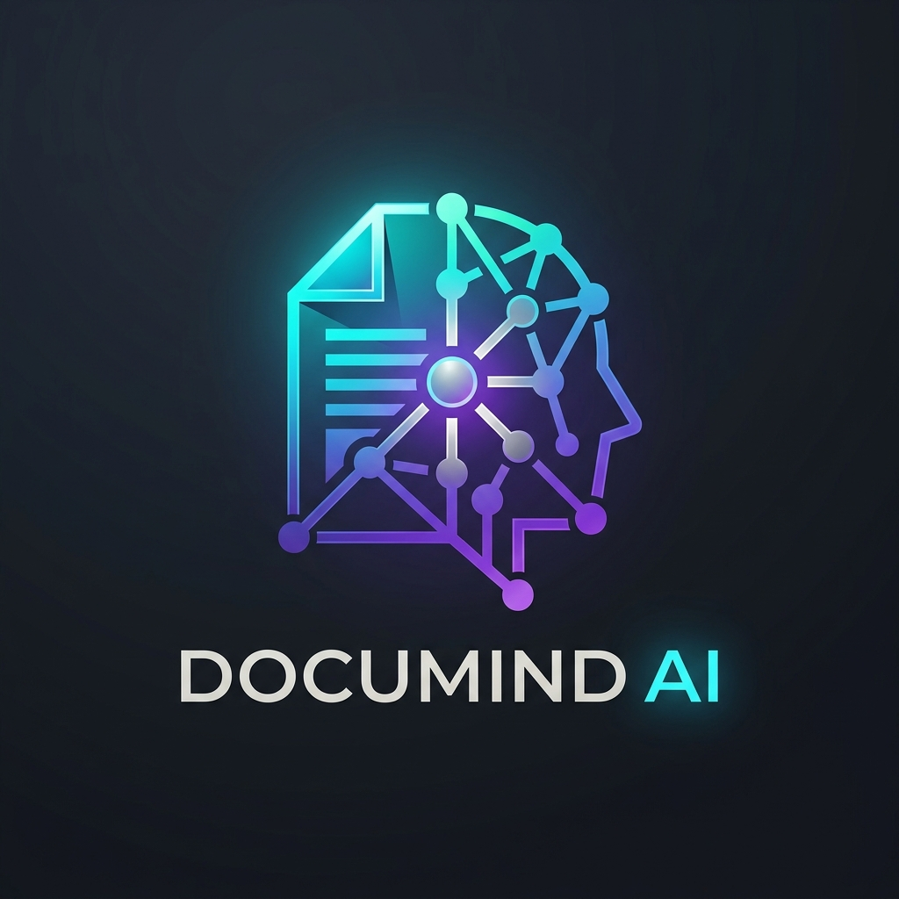
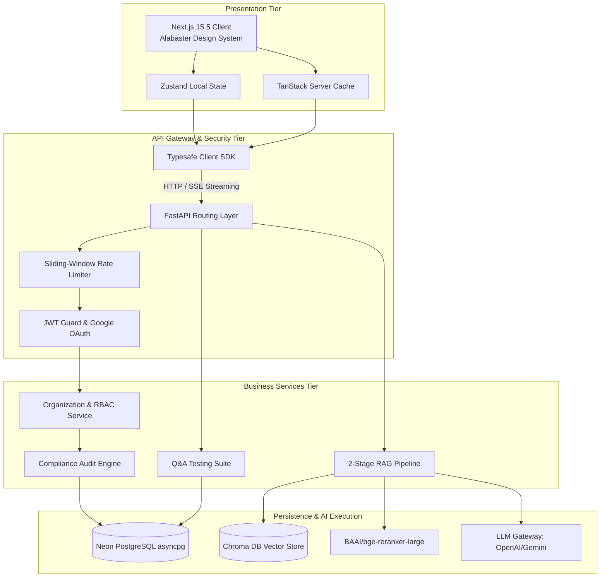
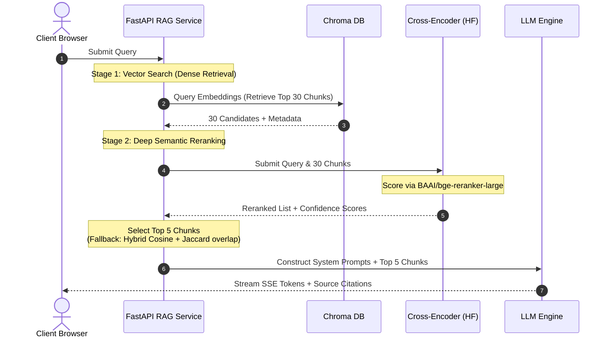

  

  <h2>Architected for Perfection. Built for Production.</h2>

  

    An enterprise-grade, full-stack AI document intelligence SaaS. Featuring a highly concurrent 2-stage Cross-Encoder Reranking RAG pipeline, multi-tenant RBAC workspaces, sliding-window rate limiters, and complete workspace audit trails.
  

  

    
    
    
    
    
    
    
  

 

  
  
<i>Demonstrating the optimized Alabaster Design System and intelligent multi-tenant AI RAG workflow.</i>

 

---

DocuMind AI is not merely an application; it is an exercise in **engineering excellence**. It represents the culmination of distributed systems architecture, advanced information retrieval pipelines, and strict security practices. Whether evaluated through the lens of a user seeking frictionless AI collaboration or a Senior Staff Engineer parsing its infrastructural decisions, DocuMind AI stands as a testament to what modern, decoupled web architecture can achieve.

## 🧭 The Product Vision (User's Perspective)

DocuMind AI fundamentally redefines how organizations interact with structural information. It transforms raw PDF documents into highly accessible, context-aware intelligence networks, backed by strict security boundaries.

### The Ultimate Enterprise Workspace
- **For the Compliance Auditor:** Instantly scan workspaces for factual contradictions, requirements compliance, and reference integrity. The testing engine verifies cross-document assertions, warning users of logical conflicts.
- **For the Enterprise Team:** DocuMind AI introduces the **Multi-Tenant Organization**. Users manage isolated organization entities, invite members with fine-grained roles (Admin, Member, Viewer), and review live audit records of all workspace operations.
- **Precision RAG Engine**: Communicate with multiple documents simultaneously. Ask complex questions and receive streaming answers complete with exact paragraph citations and trust scores, ensuring zero-hallucination outputs.

---

## 💻 The Architecture of Perfection (Engineer's Perspective)

From the very first line of code, DocuMind AI was designed to scale. It rejects monolithic limitations by decoupling presentation state from highly concurrent, asynchronous data pipelines.

### 🌟 Key Engineering Triumphs

1. **The Decoupled Monorepo Architecture:** Next.js 15 leverages edge compiler optimizations for client rendering, while an asynchronous FastAPI backend handles data ingestion, vector operations, and LLM processing. This protects the frontend from server execution timeouts during heavy document chunking or indexing processes.
2. **2-Stage Cross-Encoder Reranking:** Resolves the high-noise limit of vector databases. ChromaDB retrieves the top 30 candidate chunks, which are then passed to a deep-learning Cross-Encoder (`BAAI/bge-reranker-large`). The re-scored top 5 chunks form the LLM context. If external inference fails, a hybrid cos-similarity and Jaccard token overlap validator takes over:
   $$\text{Score} = 0.3 \times \text{TokenOverlap} + 0.7 \times \text{EmbeddingCosineSimilarity}$$
3. **Workspace Isolation & RBAC:** Enforces strict multi-tenancy. Organization members are bound to roles (`admin`, `member`, `viewer`), and authorization checks guard every API endpoint. Read-only viewers are restricted from mutating workspace state or uploading files.
4. **Sliding-Window Rate Limiting:** Built-in rate limiting isolates noisy tenants. Requests are tracked using an optimized in-memory window blocker, separating standard operations (100 req/min) from expensive LLM and vector indexing operations (10 req/min).

---

## 🏛️ System Topology

---

## 🧠 The 2-Stage Cross-Encoder Reranking Pipeline

To guarantee the highest possible quality for context generation, DocuMind AI implements a hybrid retrieval framework:

---

## 🔒 Enterprise Workspace Security & Auditing

DocuMind AI provides deep security auditing and role-based validation built directly into the core relational schema.

*   **RBAC Enforcement**: Routes are guarded via Dependency Injection. Admin privileges are required to edit organization structures or delete workspaces, members manage content, and viewers can only read RAG outputs.
*   **Audit Compliance Ledger**: Every mutating operation (document ingestion, member role alteration, workspace modifications) writes an entry to an immutable, append-only database table, recording timestamps, user IDs, event labels, and client IP mappings.
*   **Sliding-Window Protection**: Dynamic rate limits guard compute resources. If a user exceeds standard (100 req/min) or query-heavy (10 req/min) limits, the API immediately throws an `HTTP 429` error, which is caught by the client to trigger a floating warning banner.

---

## 🧪 Q&A Test Lab Suite

To measure information retrieval accuracy under different document contexts, the system integrates a permanent testing framework divided into distinct validation scopes:

*   **Easy Pack**: Evaluates direct factual retrieval with standard query-response matching.
*   **Medium Pack**: Tests semantic search resilience against paraphrasing and vocabulary shifts.
*   **Hard Pack**: Validates requirement extraction, reference chains, and conflicting document claims.
*   **Nightmare Pack**: Forces RAG pipeline validation against adversarial inputs, cross-document isolation, and multi-hop logical deductions.

---

## 📊 Relational Mastery: PostgreSQL Schema

The database is designed with third-normal-form (3NF) relational hygiene, utilizing SQLAlchemy’s asynchronous ORM drivers to execute parallel database calls.

*   **Identity & Session Core**: `users`, `sessions`
*   **Multi-Tenancy Entities**: `organizations`, `organization_members`, `workspaces`
*   **Document Intelligence Nodes**: `documents`, `document_chunks`
*   **Compliance & Logs**: `audit_logs`, `testing_logs`

---

  Crafted with relentless attention to detail by <strong>Shitesh</strong>.  
  <a href="https://docu-mind-ai-web.vercel.app/">Experience the Live Application</a>

